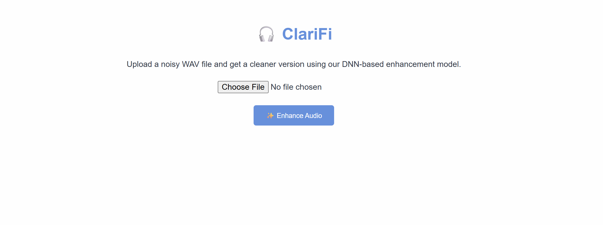
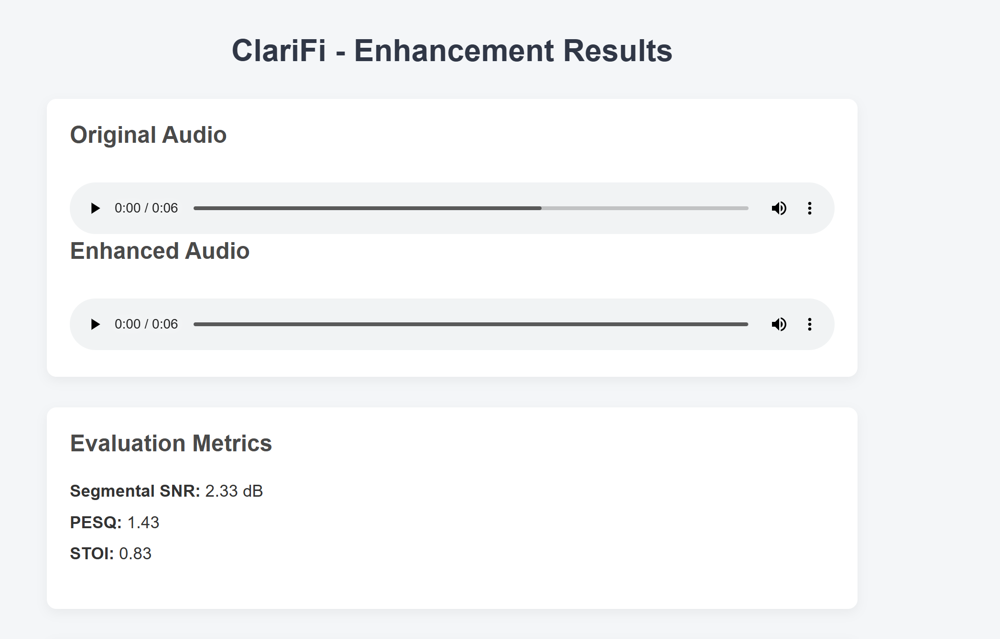
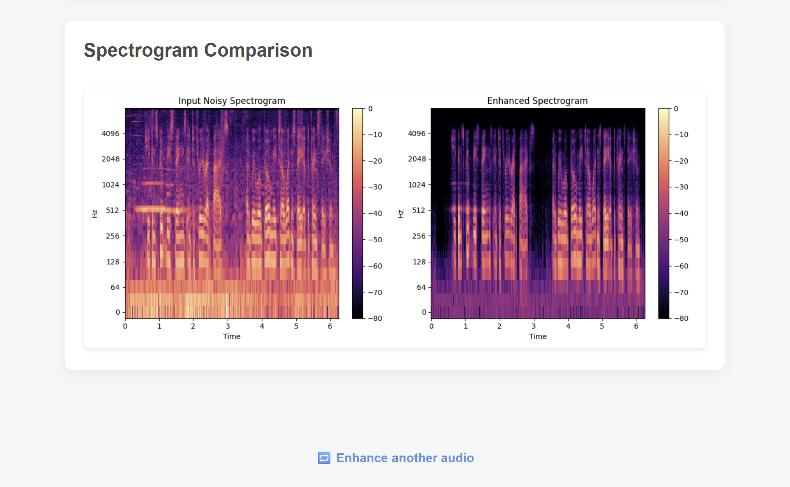

# 🎧 ClariFi: Speech Enhancement Web App

ClariFi is a simple, effective speech enhancement system built using deep learning and STFT-based features. It denoises `.wav` audio files using a trained neural network and provides audio quality metrics like PESQ, STOI, and segmental SNR.

### 🔍 Features

- 📤 Upload noisy `.wav` files
- 🧠 Enhances audio using a trained DNN
- 📊 Computes speech quality metrics:
  - Segmental SNR
  - PESQ
  - STOI
- 🎛 Visualizes noisy and enhanced spectrograms
- 🖥️ Clean and responsive web interface using Flask

---

### 🚀 Getting Started

#### 1. Clone the repo

```bash
git clone https://github.com/hardikgarg987/ClariFi.git
```

#### 2. Navigate into the project directory:

```bash
cd ClariFi
```

#### 3. Install dependencies:

```bash
pip install -r requirements.txt
```

# 🎧 ClariFi – Speech Enhancement using DNN

A deep learning-based speech enhancement app that denoises audio using a frame-wise DNN model trained on STFT magnitude spectrograms.

---

## 🧠 Model Info

- DNN model trained on STFT magnitude spectrograms  
- **Architecture**: 257 → 1024 → 257 with ReLU and dropout  
- Trained using frame-wise input from the VoiceBank-DEMAND dataset

---

## 📁 Project Structure

```
ClariFi/
├── app.py # Flask web app
├── enhance.py # Enhancement + metrics logic
├── models/
│ ├── frame_model.h5 # Trained DNN model
│ └── norm.pkl # Normalization stats
├── static/
│ ├── css/
│ ├── uploads/
│ ├── enhanced/
│ └── spectrograms/
├── templates/
│ ├── index.html
│ └── result.html
└── utils/
├── preprocess.py
├── audio_utils.py
└── metrics.py
```

---

## 📷 Screenshots








---

## 📜 License

MIT License. See [LICENSE](LICENSE) for details.

---

## 🙌 Acknowledgments

- VoiceBank-DEMAND Dataset  
- PESQ & STOI evaluation packages  
- TensorFlow & Librosa

---

## 👤 Author

**Hardik Garg**  
📧 hardikgarg987@gmail.com
🐙 GitHub: [https://github.com/Hardikgarg987](https://github.com/Hardikgarg987)
